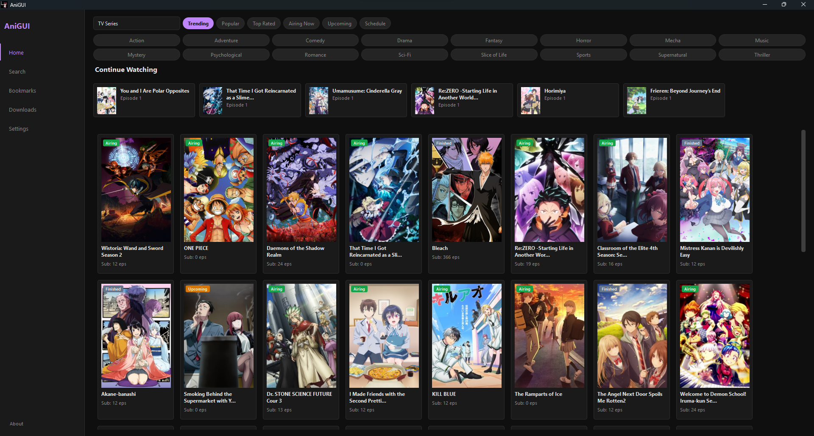

# AniGUI

AniGUI is a native desktop client prototype for streaming anime.



## How to Download/Use the Application
1. Download and extract the .zip file found in the release: https://github.com/Chxrls/AniGUI/releases/tag/v1.0.1
2. Open the extracted folder and run the .exe file.
3. For better Quality of life. You may make a shortcut for the AniGUI.exe and have it in your desktop.

## Features
- **Debounced Search:** Asynchronous searches that trigger 500ms after you stop typing (or instantly upon pressing Enter).
- **AniList Metadata & Cover Cache:** Automatically fetches cover images, scores, genres, and synopses from AniList, saving them locally in an SQLite cache and caching downloaded thumbnails on disk.
- **Local Persistence:** Local SQLite database at `~/.config/anigui/anigui.db` handles Bookmarks, Watch History, and Downloads.
- **Detached mpv Playback:** Double-clicking an episode resolves the streaming link in a worker thread and starts playback in an independent, detached `mpv` session.

## For Development, or for Installing the Application, Follow the Steps Below

### System Prerequisites
**mpv Media Player:**
This application requires `mpv` to be installed and available on your system's `PATH`.
- **Windows:** Download from [mpv.io](https://mpv.io/installation/) or install via package manager:
  ```powershell
  winget install mpv
  ```
- **macOS:** Install via Homebrew:
  ```bash
  brew install mpv
  ```
- **Linux:** Install via apt:
  ```bash
  sudo apt install mpv
  ```

## Installation

1. Clone or navigate to the repository directory.
2. Install the required dependencies:
   ```bash
   pip install -r requirements.txt
   ```

## Running the Application

To start the AniGUI client, run:
```bash
python -m anigui.main
```

## Local Directories
- **Database:** `~/.config/anigui/anigui.db`
- **Thumbnail Cache:** `~/.config/anigui/thumbnails/`
